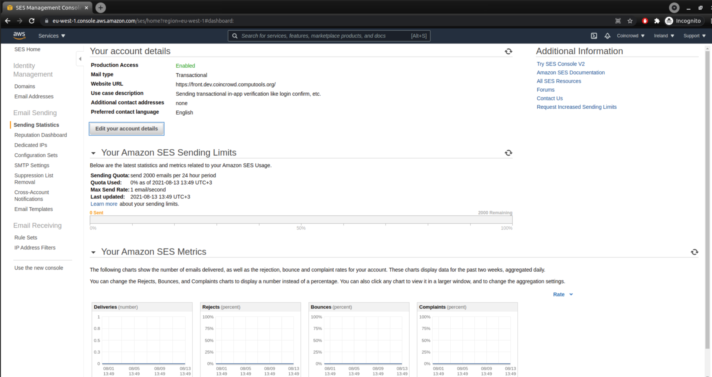

# AWS SES Production Mode Activation

1. Got to AWS SES page 
2. Press 'Edit your account details' and add next text in 'case description'. (Pat attention to set correct domain name and change description of reasons to use email if needed)
```
"Hello! 

We need an ability to send transactional in-app verification like login confirm, etc.

Our web-site is still in the active development-mode. It's a marketplace with elements of social networking.

Here you can check our landing page https://front.dev.marketplug.computools.org/auth/sign-in 

About more details, we are going send emails only to registered users and users who subscribed to our notifications manually (like order config, delivery data etc.) . User can unsubscribe from notifications or remove his account on our web-service in any time. 

About frequency of the email sending, user will get notification based on his own configuration (security notification, payment notification, user-status update notification). 

By our calculations it will be approximately 3-5 email per day for active user."
```
