# Digital Ocean

## Deploy Of Dev Infrastructure

### 1. Manually
- Create new project 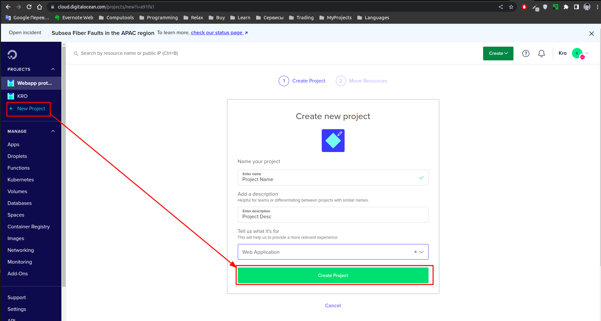
- Add SSH key to DO platform 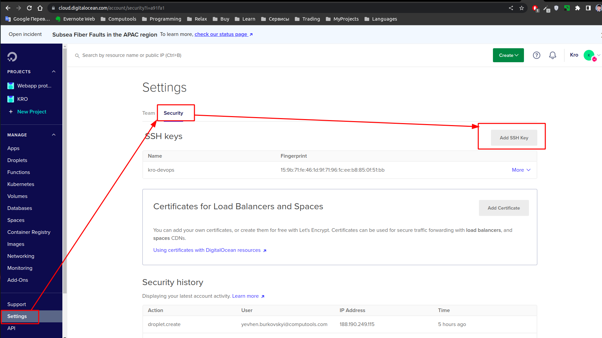
- Create DO droplet 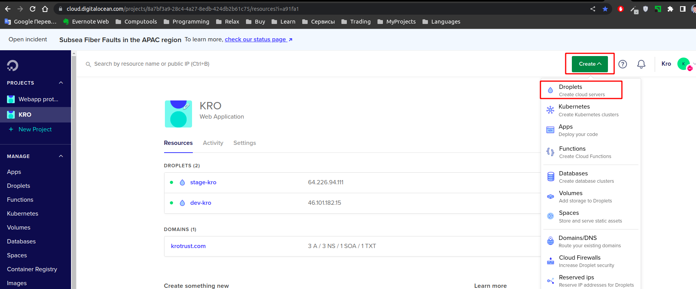 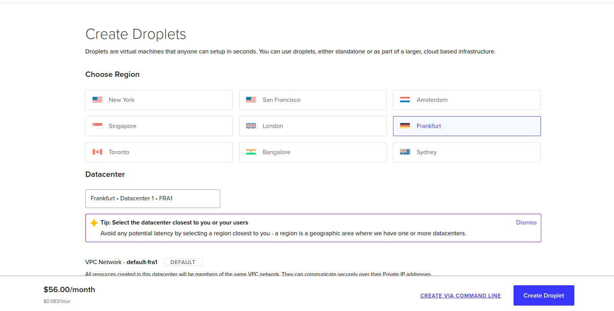 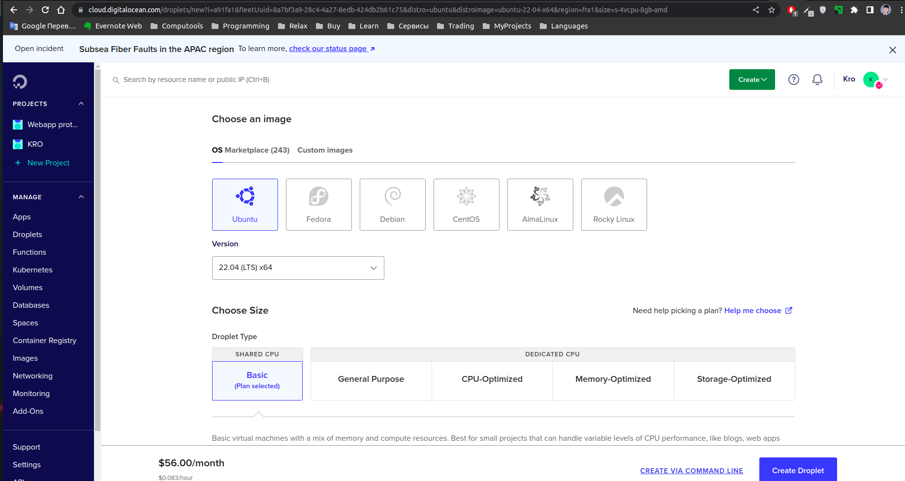 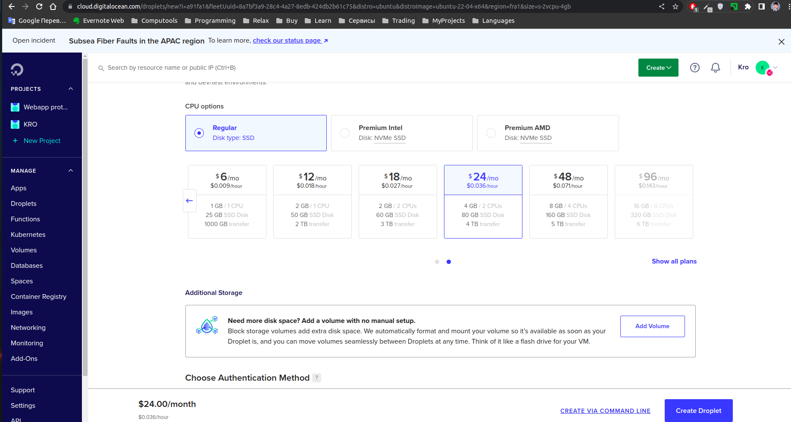 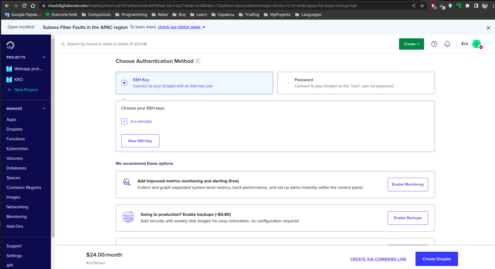 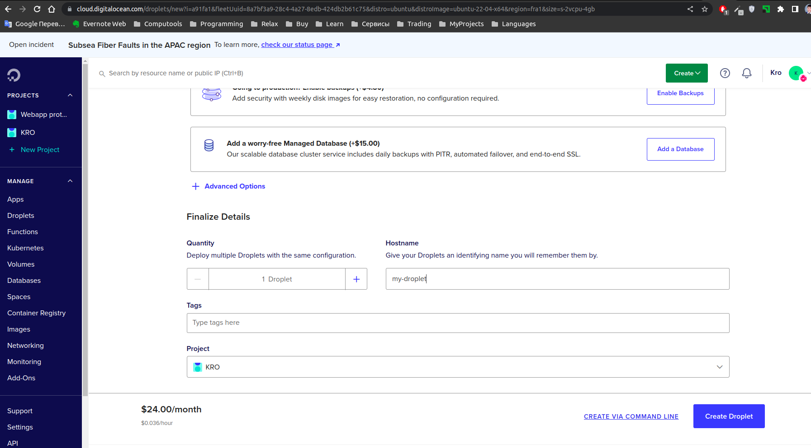
- Create DO bucket 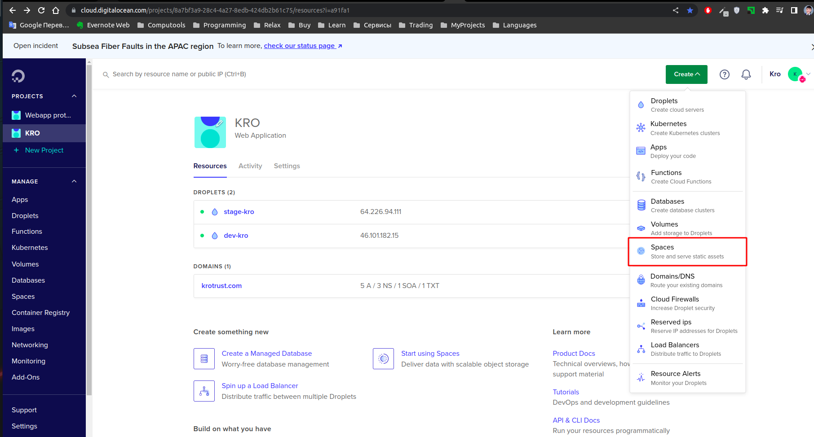 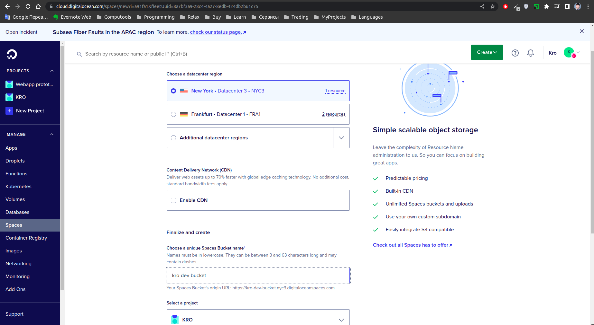 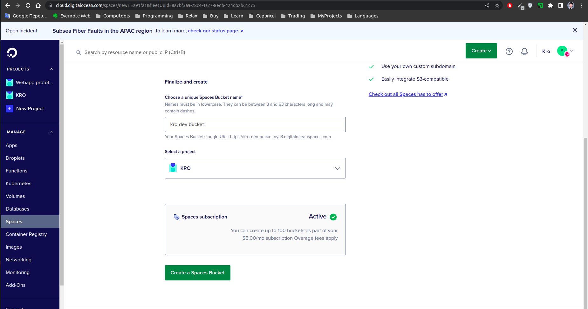
- Add domain and DNS records 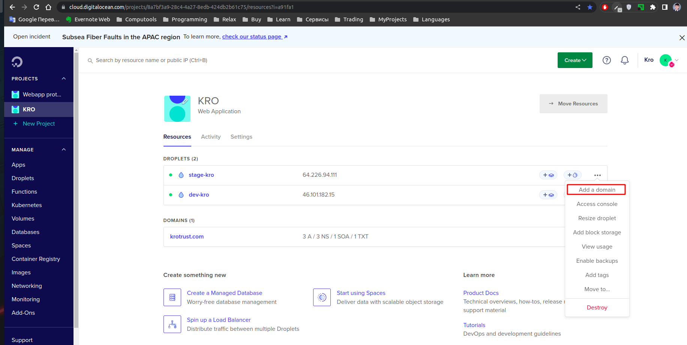 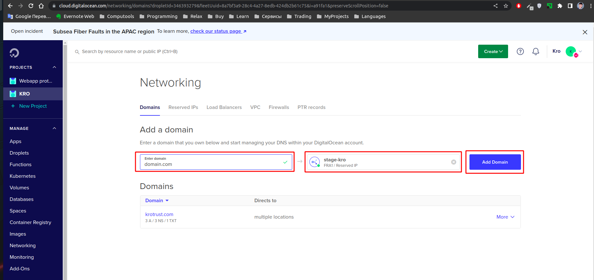 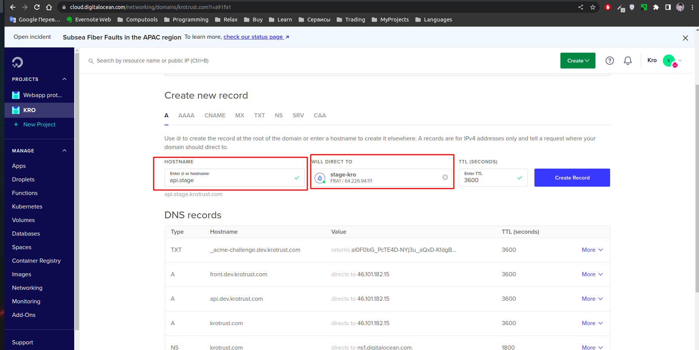 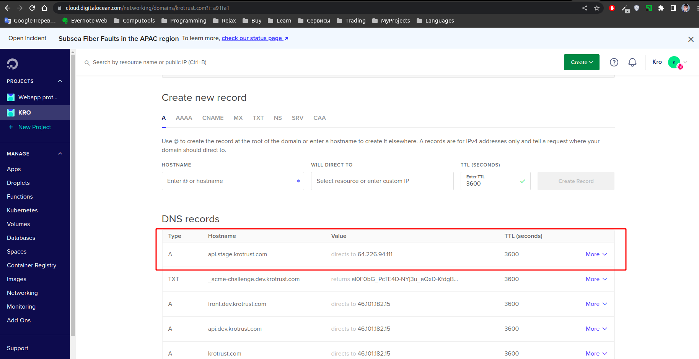
- Connect to droplet via terminal 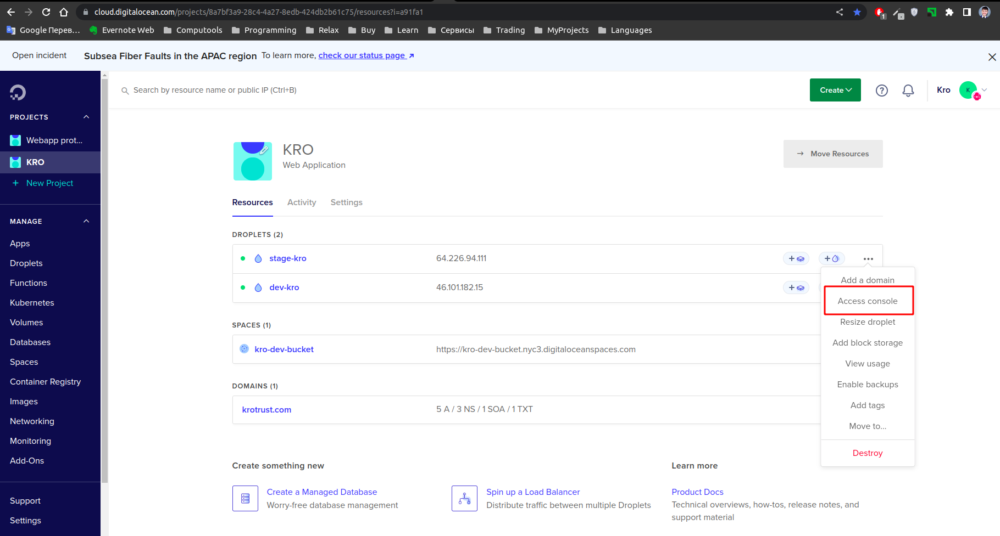 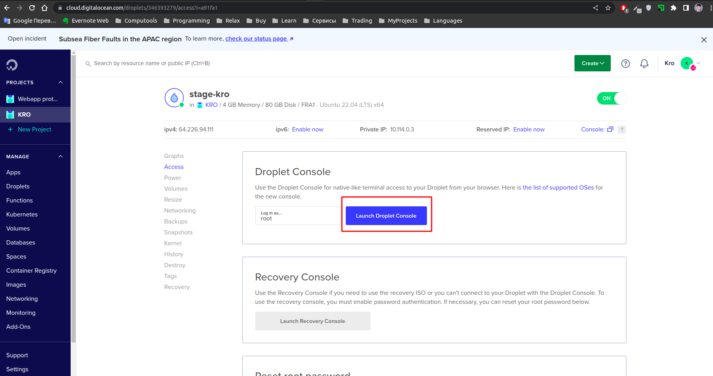
- Generate SSL certs 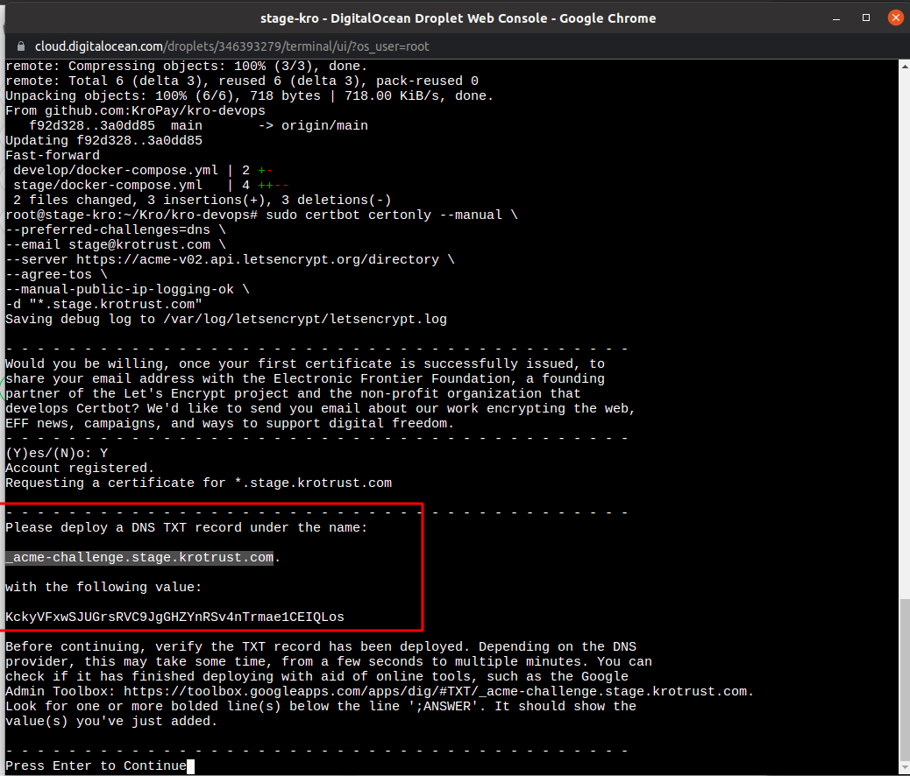 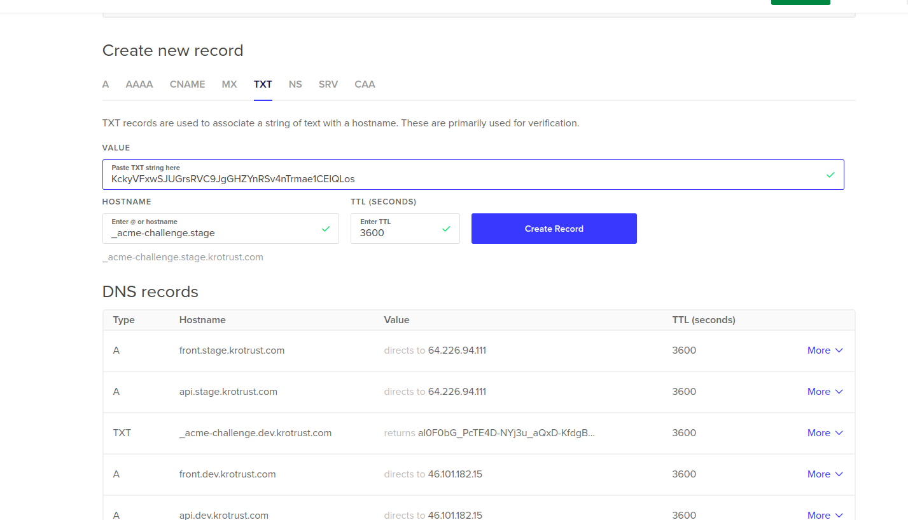

