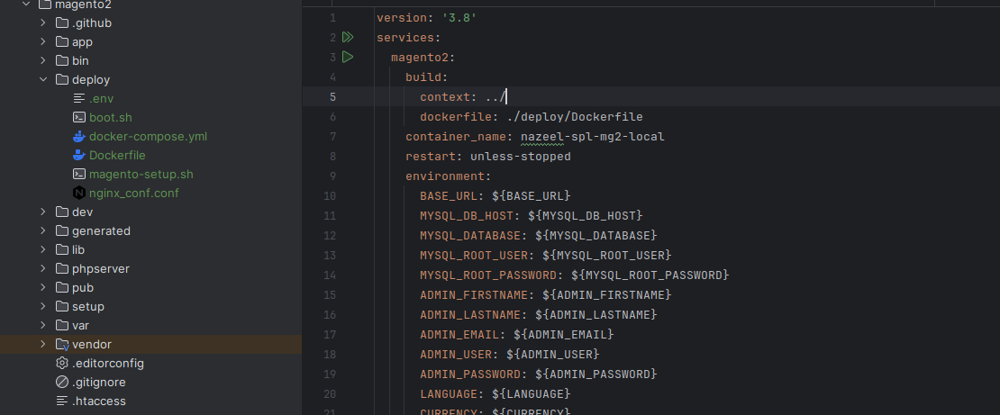
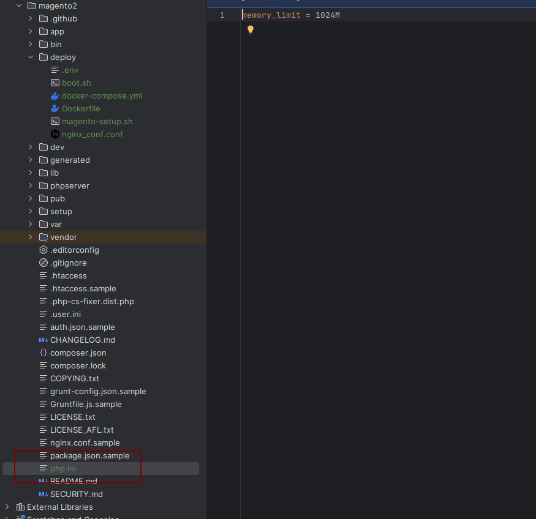
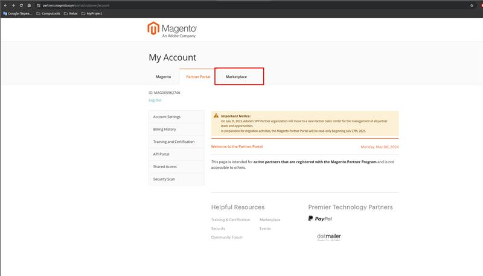
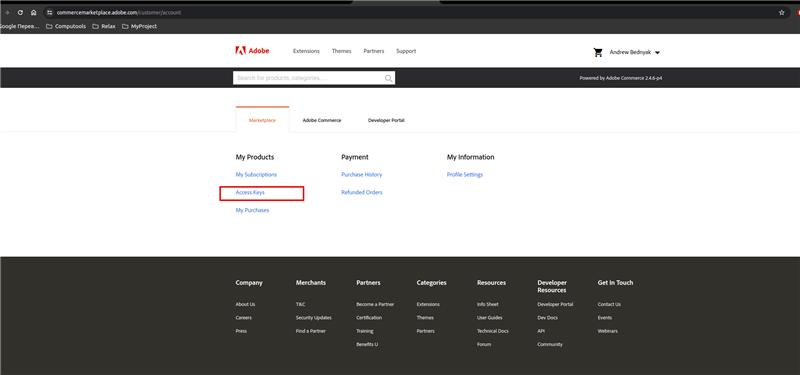
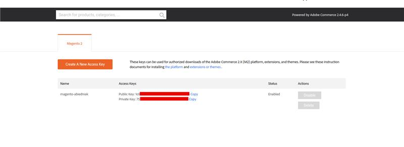
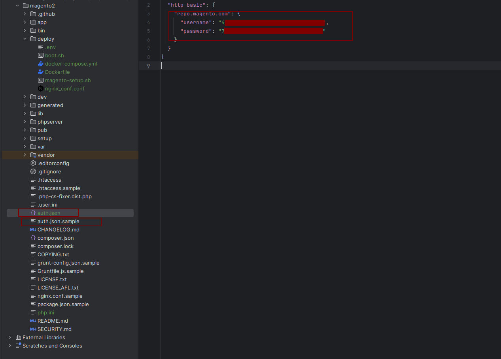
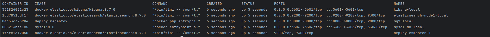

# Magento2 local deploy

This instruction describe how to deploy magento2 project locally from scratch in Docker (tested on magento 2.4-develop)

1) Clone https://github.com/magento/magento2 into desired folder
2) Open magento2 project, which was cloned, and create **deploy** directory in it
3) Copy all files from **./deploy** directory to **magento2/deploy** directory 
4) Copy **./utils/php.ini** file to **magento2** root directory 
5) Get magento auth creds from the official site
   - Register on Adobe site
   - Go to https://partners.magento.com/portal/customer/account
   - Press "Marketplace" 
   - Press "Access keys" 
   - Share me "public key" and "private key" 
6) Go to **magento2** root directory, create **auth.json** file from **auth.json.sample** and set credentials from Adobe site 
7) Go to **magento2/deploy** directory 
8) Run docker-compose.yaml
```
docker compose up -d --build
```

9) Enter the terminal of **mg2-local** container
```
docker exec -it mg2-local /bin/bash
```
10) Consult with magento dev about composer.json and compose.lock files
11) Inside of container go to **./deploy** folder, give execution rights for **magento-setup.sh** and run it
```
cd ./deploy
chmod +x ./magento-setup.sh
./magento-setup.sh
```
12) Use magento2 local
